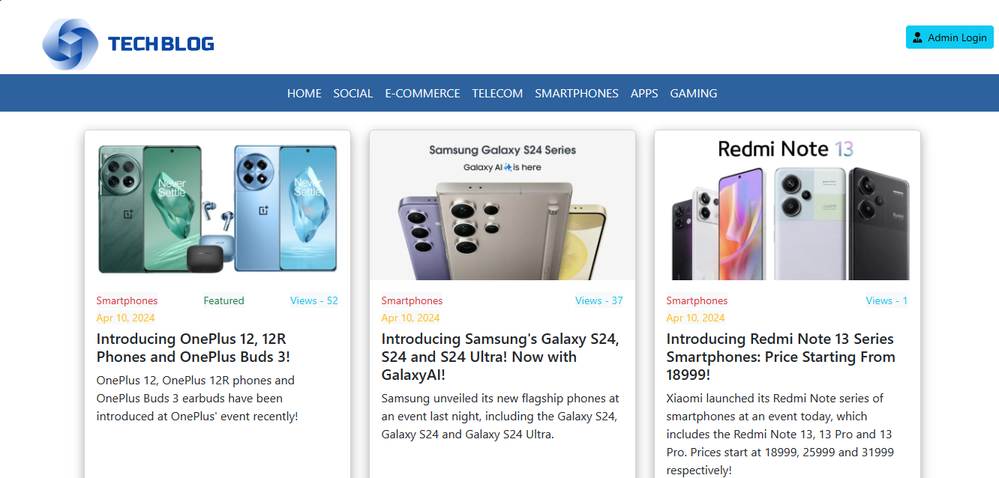

# Technology Blog developed using Angular
The following technologies are used to build it. 
<ol><li>Angular 17.3.3</li>
<li>Firebase 10.7.0</li>
<li>FireStore Database</li>
<li>Bootstrap 5.3.3</li>  
<li>Google Authentication</li>
<li>Typescript 5.4.4</li></ol>

# Blog Contents:
<ul><li>Latest Posts, Featured Posts on the Home Page</li>
<li>Subscription form at the bottom where the customers can subscribe for the latest mailing list</li>
<li>Various Categories for the Blog to select from, like Gaming, Social, Apps</li>
<li>Each Post can be opened when clicked and users can enter comments for it</li>
<li>Proceed to Buy items, do the Checkout, Shipping</li>
<li>See the list of all own orders in the Orders Section</li></ul>

# Admin Login:
<ul><li>Create, Retrieve, Update, Delete Categories</li>
<li>Create, Retrieve, Update, Delete Posts</li>
<li>View, Delete Subscribers</li>
<li>Mark/Unmark Post as Featured </li></ul>

# Preview:
 

# Development Server
Run `ng serve` for a dev server. Navigate to `http://localhost:4200/`. The application will automatically reload if you change any of the source files.

